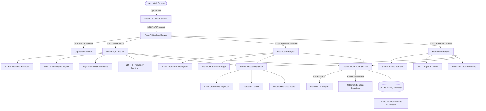

# TrueLens

> **AI-assisted media forensics and verification platform.**

## Tagline
**"Verify Before You Trust"**

---

## Problem
In an era dominated by rapid generative AI advancement, synthetic images, voice-cloned audio, and deepfake videos are routinely weaponized to spread misinformation, manipulate financial markets, and distort public trust. Traditional content consumers and journalists lack accessible, transparent, and multi-signal verification tools to evaluate whether media has undergone digital alteration or AI generation before trusting or sharing it.

Existing detection tools often operate as opaque "black boxes" that output arbitrary binary verdicts without explaining the underlying evidence, or rely on fabricated certainty. TrueLens solves this challenge by delivering deterministic, multi-signal digital forensics, transparent risk scoring, metadata traceability, and grounded evidence explanations.

---

## Solution
**TrueLens** is an end-to-end media verification platform designed for real-world authenticity assessment across **Images**, **Audio**, and **Video**. 

Rather than relying on closed synthetic scores, TrueLens extracts measurable mathematical and structural metrics from uploaded files:
1. **Multi-Signal Forensics**: Computes Error Level Analysis (ELA) compression maps, High-Pass noise residuals, 2D Fast Fourier Transform (FFT) frequency spectrum grids, Short-Time Fourier Transform (STFT) acoustic metrics, and inter-frame Mean Absolute Difference (MAD) motion continuity.
2. **Transparent Scoring**: Combines signals using weighted formulas into a transparent **Manipulation Risk Score (0–100)** and scientific verdict (*Likely Authentic*, *Inconclusive*, or *Likely Manipulated*).
3. **Source Traceability & Provenance**: Scans binary headers for camera EXIF equipment tags, C2PA Content Credentials manifests, container codecs, and modular reverse source search status.
4. **Evidence-Grounded AI Explanation**: Generates plain-language evidence explanations grounded strictly in actual forensic metrics, featuring a deterministic local fallback when external LLM services are unconfigured.

---

## Key Features
- **Image Forensic Analysis**: Multi-layer inspection combining EXIF integrity, ELA compression heatmaps, High-Pass noise residual correlation, and 2D FFT spectral grid detection.
- **Audio Forensic Analysis**: STFT frequency-domain evaluation including spectral centroid, spectral flatness index, zero-crossing rate (ZCR), RMS energy dynamics, and dynamic spectrogram visualization.
- **Video Forensic Analysis**: Keyframe sampling, inter-frame MAD optical motion difference, frame-level ELA compression variance, and extracted audio track forensics.
- **Transparent Risk Score & Verdict**: Dynamic scoring (0–100) mapped to conservative verdicts (*Likely Authentic*, *Inconclusive*, *Likely Manipulated*) with assessment confidence percentages.
- **Visual Evidence Viewers**: Interactive side-by-side ELA compression heatmap toggle, STFT spectrogram visualizer, and sampled video keyframe inspection gallery.
- **Metadata & Camera Hardware Verification**: Detailed camera make/model, lens metadata, software editing signatures, sample rates, bitrates, and video codec parameters.
- **C2PA / Content Credentials Inspection**: Binary JUMBF header scanner detecting signed manifest presence, issuer, claim tool, and verification status.
- **Source & Provenance Timeline**: Stage-by-stage verification timeline tracking detected, absent, or unconfigured provenance signals.
- **Evidence-Grounded Explanation**: AI-powered explanation layer providing clear summaries, key findings, limitation disclosures, and actionable guidance without hallucinating facts.
- **Analysis History**: Local SQLite persistent history drawer allowing users to review, inspect, or delete past multi-media verification reports.
- **Secure File Handling**: In-memory binary processing, strict MIME validation, file size safety caps, and zero storage of unhashed upload files.
- **Accessibility-Focused Interface**: Dark-mode glassmorphism UI built with high-contrast elements, screen-reader ready tab navigation, and clear visual indicators.

---

## How It Works

```text
UPLOAD  ──►  ANALYZE  ──►  VERDICT + RISK  ──►  FORENSIC EVIDENCE  ──►  EXPLANATION  ──►  PROVENANCE  ──►  RECOMMENDATION
```

1. **Upload**: User drags & drops or selects an Image (`JPG`, `PNG`, `WebP`), Audio (`WAV`, `MP3`, `FLAC`, `M4A`), or Video (`MP4`, `WebM`, `MOV`, `AVI`, `MKV`) file.
2. **Analyze**: Backend safety filters validate the file format and run media-specific forensic extractors.
3. **Verdict + Risk**: Signal metrics are aggregated into a transparent risk score (0–100) and confidence rating.
4. **Forensic Evidence**: Interactive visual heatmaps, frequency grids, keyframe galleries, and individual signal score cards display measurable proof.
5. **Explanation**: The GenAI/Local explanation layer synthesizes findings into plain language.
6. **Source / Provenance**: Binary header inspection extracts camera EXIF tags, C2PA manifests, and provenance timelines.
7. **Recommendation**: Clear, non-alarmist advisory guides the user on safe next steps.

---

## Media Analysis

### Image Forensics
| Signal | Method | Metric Evaluated | Synthetic/Manipulation Indicator |
| :--- | :--- | :--- | :--- |
| **EXIF Metadata** | Header Extraction | Camera Make/Model vs Software Tag | Software editing tags (`Adobe Photoshop`, `GIMP`) or missing camera hardware signatures |
| **Error Level Analysis (ELA)** | Differential Re-compression | Compression Error Level & Heatmap | Inconsistent error levels between image regions indicating localized editing or AI synthesis |
| **Noise Residuals** | High-Pass Filter & RGB Correlation | Noise Standard Deviation & Channel Variance | Unnaturally uniform or smooth noise distribution typical of diffusion model outputs |
| **2D FFT Frequency Grid** | Fast Fourier Transform | High-Frequency Spectral Decay & Energy Spikes | Periodic grid spikes or unnatural high-frequency energy cutoffs from generative GAN/diffusion upscaling |

### Audio Forensics
| Signal | Method | Metric Evaluated | Voice Synthesis/Cloning Indicator |
| :--- | :--- | :--- | :--- |
| **Spectral Centroid & Flatness** | STFT Spectral Analysis | Spectral Flatness Index & Frequency Rolloff | Elevated spectral flatness index (> 0.08) indicating synthetic robotic noise plateaus or neural speech synthesis |
| **Waveform Dynamics & Energy** | Time-Domain Analysis | Zero-Crossing Rate (ZCR) & RMS Energy | Abnormally static zero-crossing distributions (< 0.01 or > 0.35) and dynamic clipping step changes |
| **Dynamic Spectrogram** | STFT Heatmap Generation | Frequency vs Time Spectrogram Base64 | Visual display of acoustic resonance, harmonic structure, and frequency cutoffs |

### Video Forensics
| Signal | Method | Metric Evaluated | Deepfake / Video Manipulation Indicator |
| :--- | :--- | :--- | :--- |
| **Keyframe Sampler** | Representative Frame Extraction | 5 keyframes sampled across video duration | Keyframe visual inspection gallery with timestamp labels |
| **Motion Continuity (MAD)** | Inter-frame Difference | Mean Absolute Difference (MAD) Avg & Std | Abrupt temporal frame jumps (avg MAD > 45.0) or inconsistent optical flow transition variance |
| **Frame Compression ELA** | Keyframe ELA Analysis | Inter-frame ELA Mean Error & Variance | Spatial compression variance across keyframes (average error > 12.0) |
| **Extracted Audio Forensics** | Demuxed Audio Analysis | Audio Track Acoustics (via RealAudioAnalyzer) | Synthetic speech indicators in video background/vocal audio stream |

---

## Provenance & Verification

TrueLens integrates a modular source traceability suite to inspect media lineage:
- **Metadata Extraction**: Reads genuine EXIF tags, camera hardware details, GPS coordinates, audio bitrates/sample rates, and video container codecs.
- **C2PA Content Credentials**: Binary scanner checks for JUMBF metadata structures containing signed content credentials, issuer identity, and assertion claims.
- **Modular External Source Search**: Adapter interface for connecting reverse media search providers (e.g., Google Vision, TinEye).

> [!IMPORTANT]  
> **Scientific Integrity Rules**:
> - Missing metadata or the absence of C2PA Content Credentials **does NOT prove manipulation**, as many social media platforms strip metadata upon upload.
> - External source search is marked as **"Not configured"** when API keys are unconfigured, rather than generating synthetic reverse-search matches or mock URLs.

---

## AI Explanation Layer

The AI/LLM integration in TrueLens functions strictly as an **explanation layer**, not as the underlying forensic detection engine. Forensic scores are calculated deterministically by mathematical signal extractors.

- **Strict Grounding**: System instructions constrain the explanation service to analyze only the provided JSON analysis payload, preventing hallucinations or false certainty.
- **Deterministic Local Fallback**: If `GOOGLE_API_KEY` (Gemini) is unconfigured or unavailable, TrueLens automatically executes `LocalEvidenceExplainer`, generating structured, evidence-grounded bullet points without external network calls.
- **Conservative Language**: Explanations explicitly state uncertainty and missing evidence, avoiding claims of absolute proof.

---

## Technology Stack

### Frontend
- **Framework**: React 19 (`react`, `react-dom`)
- **Build Tool**: Vite 8 (`@vitejs/plugin-react`)
- **Styling**: Tailwind CSS 4 (`@tailwindcss/vite`, `tailwindcss`)
- **Iconography**: Lucide React (`lucide-react`)
- **HTTP Client**: Axios (`axios`)

### Backend
- **Framework**: FastAPI (`fastapi`, `uvicorn`, `pydantic`)
- **Image Processing**: Pillow (`PIL`), NumPy
- **Audio Processing**: SciPy (`scipy.io.wavfile`, `scipy.signal`), NumPy
- **Video & Vision Processing**: OpenCV (`cv2`), NumPy
- **Database**: SQLite3 (Python standard library `sqlite3`)
- **Testing**: PyTest (`pytest`, `TestClient`, `anyio`)

---

## Architecture



---

## API Endpoints

All endpoints return JSON responses.

| Method | Endpoint | Description |
| :--- | :--- | :--- |
| `GET` | `/` | API Root information and documentation links |
| `GET` | `/api/health` | Service health status and detector availability |
| `GET` | `/api/capabilities` | Reports active engine capabilities (`image`, `audio`, `video`, `c2pa`, `genai_explanation`) |
| `POST` | `/api/analyze` | Analyzes uploaded image (`multipart/form-data`) |
| `POST` | `/api/analyze/audio` | Analyzes uploaded audio (`multipart/form-data`) |
| `POST` | `/api/analyze/video` | Analyzes uploaded video (`multipart/form-data`) |
| `GET` | `/api/history` | Fetches saved analysis history (supports `limit`, `offset`, `media_type` filters) |
| `GET` | `/api/history/{id}` | Fetches full detailed analysis report by ID |
| `DELETE` | `/api/history/{id}` | Deletes analysis record from local database |

---

## Project Structure

```text
TrueLens/
├── .env.example                    # Environment variable template
├── .gitignore                      # Git exclusion rules
├── README.md                       # Platform documentation
├── backend/                        # FastAPI Python backend
│   ├── README.md                   # Backend documentation
│   ├── requirements.txt            # Python dependencies
│   ├── app/
│   │   ├── api/                    # API route handlers
│   │   │   ├── analyze.py          # Upload endpoints for image, audio, video
│   │   │   ├── capabilities.py     # Capabilities discovery endpoint
│   │   │   ├── health.py           # Healthcheck endpoint
│   │   │   └── history.py          # Database history CRUD endpoints
│   │   ├── database.py             # SQLite database initialization & queries
│   │   ├── main.py                 # FastAPI application initialization & CORS
│   │   └── services/               # Core forensic calculation engines
│   │       ├── audio_features.py   # STFT acoustic & waveform metric extractor
│   │       ├── c2pa_inspector.py   # C2PA binary header JUMBF scanner
│   │       ├── ela.py              # Error Level Analysis compression engine
│   │       ├── exif_parser.py      # EXIF & hardware camera metadata parser
│   │       ├── explanation_service.py # Grounded GenAI & local fallback explainer
│   │       ├── external_reverse_search.py # Modular reverse search provider
│   │       ├── frequency.py        # 2D FFT spectral grid analyzer
│   │       ├── metadata_verifier.py# Comprehensive metadata inspector
│   │       ├── noise_analysis.py   # High-pass noise residual filter
│   │       ├── source_verifier.py  # Provenance suite orchestrator
│   │       ├── video_features.py   # Video frame sampler & MAD temporal analyzer
│   │       └── detectors/          # Modular detector abstractions
│   │           ├── base.py         # Image detection base schema
│   │           ├── base_audio.py   # Audio detection base schema
│   │           ├── base_video.py   # Video detection base schema
│   │           ├── external.py     # External model interface
│   │           ├── real_analyzer.py# Real image forensic engine implementation
│   │           ├── real_audio_analyzer.py # Real audio forensic engine implementation
│   │           └── real_video_analyzer.py # Real video forensic engine implementation
│   └── tests/                      # Pytest automated test suite
│       ├── test_api.py             # Image API & history tests
│       ├── test_audio_api.py       # Audio API tests
│       ├── test_explanation_api.py # Explanation & fallback tests
│       ├── test_provenance_api.py  # Provenance & C2PA tests
│       └── test_video_api.py       # Video API tests
└── frontend/                       # React + Vite frontend
    ├── README.md                   # Frontend documentation
    ├── public/                     # Static assets & icons
    ├── src/
    │   ├── App.css                 # Custom layout styles
    │   ├── App.jsx                 # Main application dashboard controller
    │   ├── index.css               # Tailwind CSS rules & glassmorphism theme
    │   ├── main.jsx                # React DOM entry point
    │   ├── components/             # React UI components
    │   │   ├── AiExplanation.jsx   # GenAI evidence explanation card
    │   │   ├── AudioDropzone.jsx   # Audio drag & drop upload interface
    │   │   ├── AudioPlayerPreview.jsx # Audio playback preview
    │   │   ├── Dropzone.jsx        # Image drag & drop upload interface
    │   │   ├── ElaViewer.jsx       # ELA heatmap visualizer
    │   │   ├── FrameViewer.jsx     # Video keyframe gallery inspector
    │   │   ├── Header.jsx          # Top navigation bar
    │   │   ├── HistoryDrawer.jsx   # Interactive history drawer
    │   │   ├── ImagePreview.jsx    # Image preview & trigger button
    │   │   ├── MediaTabs.jsx       # Image / Audio / Video tab selector
    │   │   ├── MetadataTable.jsx   # Metadata inspector table
    │   │   ├── ProcessingState.jsx # Forensic execution progress view
    │   │   ├── ProvenanceCard.jsx  # Provenance timeline & C2PA card
    │   │   ├── Recommendations.jsx # Action advisory banner
    │   │   ├── SignalCard.jsx      # Individual signal breakdown card
    │   │   ├── SpectrogramViewer.jsx # STFT acoustic spectrogram visualizer
    │   │   ├── VerdictBanner.jsx   # Verdict & risk score summary banner
    │   │   ├── VideoDropzone.jsx   # Video drag & drop upload interface
    │   │   ├── VideoPlayerPreview.jsx # Video player preview
    │   │   └── WhatWeFound.jsx     # Plain-language observations box
    │   ├── services/
    │   │   └── api.js              # Axios API service client
    │   └── utils/
    │       └── formatters.js       # Formatting utilities
    ├── package.json                # NPM dependencies
    └── vite.config.js              # Vite configuration
```

---

## Running Locally

### Prerequisites
- **Python 3.10+** (Python 3.13 tested)
- **Node.js 18+** & `npm`

### 1. Backend Setup
Navigate to the `backend` directory, install dependencies, and launch Uvicorn:

```bash
cd backend
pip install -r requirements.txt
python -m uvicorn app.main:app --host 127.0.0.1 --port 8000
```
- The API will start at `http://127.0.0.1:8000`.
- OpenAPI documentation is available at `http://127.0.0.1:8000/docs`.

*(Optional)* To enable Gemini LLM explanation generation, set the environment variable:
```bash
# Windows PowerShell
$env:GOOGLE_API_KEY="your-gemini-api-key"

# Linux/macOS
export GOOGLE_API_KEY="your-gemini-api-key"
```
If unconfigured, TrueLens automatically runs `LocalEvidenceExplainer`.

### 2. Frontend Setup
In a separate terminal, navigate to the `frontend` directory, install dependencies, and start Vite:

```bash
cd frontend
npm install
npm run dev -- --host 127.0.0.1 --port 3000
```
- Open `http://127.0.0.1:3000/` in your browser.

---

## Testing

### Automated Backend Tests
Run the complete Pytest suite from the repository root:

```bash
python -m pytest backend/tests/
```
**Current Test Coverage Results**: **27 passed tests** across 5 test modules (`test_api.py`, `test_audio_api.py`, `test_explanation_api.py`, `test_provenance_api.py`, `test_video_api.py`).

### Frontend Build Verification
Verify production bundle compilation:

```bash
cd frontend
npm run build
```
Generates production assets in `frontend/dist/` without compilation errors.

---

## Security

- **File Upload Limits**: Enforces strict payload limits (10MB for images, 25MB for audio, 100MB for video) to prevent denial-of-service memory exhaustion.
- **Header & Format Validation**: Uses Pillow `verify()` and OpenCV header inspection to catch corrupted or malformed binaries safely.
- **In-Memory Processing**: File buffers are processed in memory without writing temporary files to unmonitored disk locations.
- **Global Exception Masking**: Production exception handler catches internal runtime exceptions and returns safe generic error messages, preventing stack trace exposure.
- **Secret Isolation**: Remote API keys are retrieved from environment variables (`GOOGLE_API_KEY`), never hardcoded in source files.

---

## Accessibility

- **High-Contrast Dark Theme**: Designed with slate-950 background surfaces and cyan/amber/rose accent indicators for readability.
- **Interactive Focus States**: Focus outlines and keyboard-navigable tab switching across media types (`Image`, `Audio`, `Video`).
- **Semantic Badging**: Distinct color, severity labels, and text descriptions complement visual risk score bars for screen readers.

---

## Limitations

- **Statistical Indicators**: TrueLens forensic metrics represent statistical risk indicators, not absolute legal proof of authenticity or manipulation.
- **Imperfection of Detection**: Advanced or highly customized generative AI models may evade specific signal detectors.
- **Platform Metadata Stripping**: The absence of EXIF metadata or C2PA credentials is common on social media platforms and does not inherently prove manipulation.
- **External Search Configuration**: Reverse image/source search requires external API credentials and is reported as unconfigured by default.
- **High-Stakes Decision Advisory**: Automated media assessments should always be complemented by independent journalist or expert verification for critical media.

---

## Hackathon Context

TrueLens was developed for the **PromptWars × μLearn Hackathon** under the **"Deepfake & Misinformation Shield"** challenge statement:
> *"Build a GenAI-powered web platform that helps users detect, understand, and verify potentially AI-generated or manipulated images, audio, and video before they trust or share them."*

---

## Future Improvements

- **Trained Deep Learning Classifiers**: Integrate specialized neural network models (e.g., MesoNet, EfficientNet) alongside deterministic signal extraction.
- **C2PA Manifest Signing Tools**: Add local manifest signing capabilities for content creators to attach provenance credentials to original media.
- **Expanded Reverse Search Adapters**: Provide native integrations for Google Cloud Vision API and TinEye API production keys.

---

## License

No open-source license has currently been specified for this hackathon repository.
